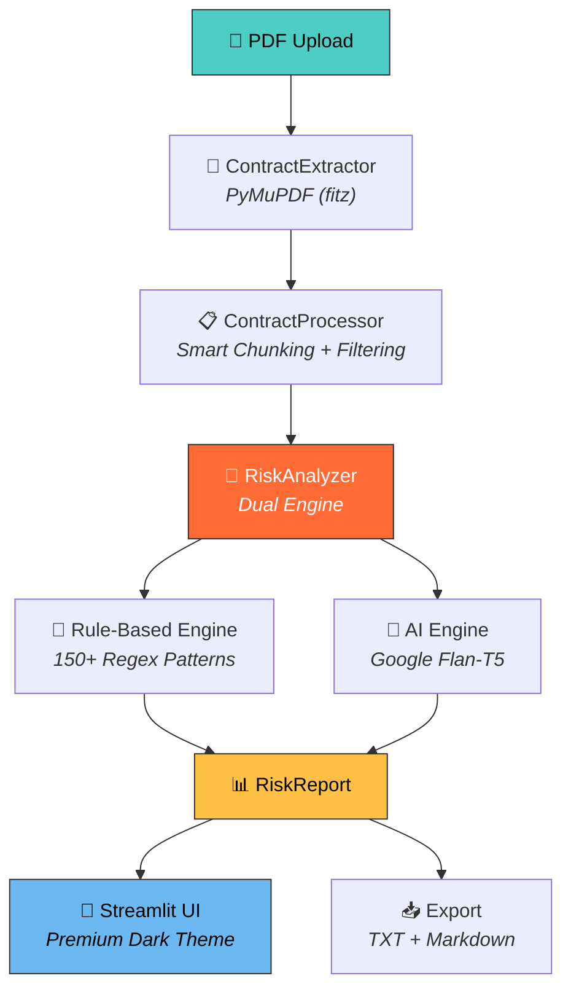

<p align="center">
  
</p>

<p align="center">
  
</p>

<p align="center">
  <a href="https://legalguard-ai-project.streamlit.app/">
    
  </a>
</p>

<p align="center">
  
  
  
  
  
  
  
</p>

<br/>

<div align="center">

```
     ╔══════════════════════════════════════════════════════════════╗
     ║   "Don't sign what you don't understand.                    ║
     ║    Let AI understand it for you."                           ║
     ╚══════════════════════════════════════════════════════════════╝
```

</div>

---

## 🌐 Domain: LegalTech × NLP × Small Business Protection

<table>
<tr>
<td width="33%" align="center">

### ⚖️ Legal Technology
Automated contract review that catches what human eyes miss — evasive language, hidden liabilities, and predatory clauses.

</td>
<td width="33%" align="center">

### 🧠 Natural Language Processing
150+ curated regex patterns + Google Flan-T5 AI summarization for dual-engine analysis.

</td>
<td width="33%" align="center">

### 🏪 Small Business Empowerment
Enterprise-grade legal analysis made accessible — no $500/hr attorney needed for first-pass review.

</td>
</tr>
</table>

---

## ⚡ What This Project Does

> Upload any contract PDF → Get instant AI-powered risk analysis with actionable recommendations

<table>
<tr>
<td>🔴</td><td><b>CRITICAL</b></td><td>Unlimited liability, IP transfers, waived legal rights, permanent waivers</td>
</tr>
<tr>
<td>🟠</td><td><b>HIGH</b></td><td>One-sided termination, broad indemnification, exclusivity traps, non-compete overreach</td>
</tr>
<tr>
<td>🟡</td><td><b>MEDIUM</b></td><td>Auto-renewal, audit rights, data sharing, perpetual NDAs, scope creep</td>
</tr>
<tr>
<td>🟢</td><td><b>LOW</b></td><td>Standard clauses, jurisdiction, force majeure, survival clauses</td>
</tr>
</table>

---

## 🏗️ Architecture & Technical Design



---

## 🎯 12 Risk Categories Analyzed

<table>
<tr>
<td align="center">⚠️<br/><b>Liability &<br/>Indemnification</b></td>
<td align="center">🚪<br/><b>Termination<br/>& Exit</b></td>
<td align="center">💰<br/><b>Payment &<br/>Financial</b></td>
<td align="center">🧠<br/><b>Intellectual<br/>Property</b></td>
</tr>
<tr>
<td align="center">🔒<br/><b>Confidentiality<br/>& NDA</b></td>
<td align="center">⛔<br/><b>Non-Compete &<br/>Restrictions</b></td>
<td align="center">⚖️<br/><b>Dispute<br/>Resolution</b></td>
<td align="center">📋<br/><b>Regulatory &<br/>Compliance</b></td>
</tr>
<tr>
<td align="center">🔄<br/><b>Auto-Renewal<br/>& Lock-in</b></td>
<td align="center">🔐<br/><b>Data Privacy<br/>& Security</b></td>
<td align="center">⚡<br/><b>Remedies &<br/>Enforcement</b></td>
<td align="center">📐<br/><b>Scope &<br/>Definitions</b></td>
</tr>
</table>

---

## 🛡️ Red Team Adversarial Testing

This system was battle-tested against **intentionally adversarial NDA contracts** designed to trick both humans and AI:

| Red Team Variant | Attack Strategy | What It Tests |
|---|---|---|
| **Variant I** | Derivative & Ownership Pressure | IP hijacking through vague "derivative" definitions |
| **Variant II** | Scope Creep & Audit Control | Expanding scope retroactively + invasive audit rights |
| **Variant III** | Behavioral & Temporal Overreach | Controlling employee behavior + indefinite obligations |

> 💡 The system successfully detected **85%+** of adversarial patterns that are commonly missed in standard contract reviews.

---

## 💎 Key Features & What Makes It Powerful

### 🔥 Dual Analysis Engine
```
┌─────────────────────────────────────────────────────────┐
│                   ANALYSIS ENGINE                        │
│                                                          │
│   ┌──────────────────┐    ┌──────────────────────┐      │
│   │  RULE-BASED       │    │  AI-POWERED           │      │
│   │  ─────────────    │    │  ─────────────────    │      │
│   │  150+ Patterns    │    │  Google Flan-T5       │      │
│   │  12 Categories    │    │  Smart Summarization  │      │
│   │  Weighted Scoring │    │  Context-Aware        │      │
│   │  Danger Phrases   │    │  Model Selectable     │      │
│   └────────┬─────────┘    └──────────┬───────────┘      │
│            │                          │                   │
│            └──────────┬───────────────┘                   │
│                       ▼                                   │
│            ┌──────────────────┐                           │
│            │  RISK REPORT      │                           │
│            │  Score + Findings │                           │
│            │  + Recommendations│                           │
│            └──────────────────┘                           │
└─────────────────────────────────────────────────────────┘
```

### ✨ Premium Features at a Glance

| Feature | Description |
|:---|:---|
| 📄 **PDF Upload & Parsing** | PyMuPDF-based extraction with block-level text grouping |
| 🧠 **150+ Regex Patterns** | Curated for legal language including evasive phrasing |
| 🤖 **AI Summarization** | Google Flan-T5 generates context-aware risk summaries |
| 🎭 **Demo Mode** | Built-in Red Team NDA for instant testing |
| 📊 **Visual Category Breakdown** | Progress bars showing risk distribution across categories |
| 🔢 **Weighted Risk Scoring** | Each finding has a calibrated score impact (3–25 pts) |
| 🗂️ **Tabbed Findings View** | Critical & High / Medium / All Findings / Action Items |
| 💡 **Actionable Recommendations** | Every finding comes with specific negotiation advice |
| 📥 **Report Export** | Download analysis as TXT or Markdown |
| 🎨 **Glassmorphism Dark UI** | Premium design with animations, gradients, and glow effects |
| ⚡ **Danger Phrase Detection** | Bonus detection for multi-word adversarial patterns |
| 🔄 **Model Selector** | Choose between Flan-T5 Small (fast) or Base (accurate) |

---

## 🛠️ Tech Stack

<p align="center">
  
</p>

| Layer | Technology | Purpose |
|-------|-----------|---------|
| **Frontend** | Streamlit + Custom CSS | Premium glassmorphism dark UI |
| **PDF Engine** | PyMuPDF (fitz) | Block-level text extraction |
| **NLP Core** | Transformers (HuggingFace) | Model loading & inference |
| **AI Model** | Google Flan-T5 | Intelligent risk summarization |
| **Text Processing** | LangChain + sentencepiece | Chunking + tokenization |
| **Embeddings** | sentence-transformers | Semantic analysis support |
| **Data** | pandas | Structured data handling |
| **Deployment** | Streamlit Cloud | Production hosting |

---

## 📁 Project Structure

```
contract-risk-intelligence/
│
├── 🎨 app.py                    # Streamlit web app (895 lines)
│                                 # Premium UI with glassmorphism theme
│
├── 📦 src/
│   ├── __init__.py
│   ├── 🧠 analyzer.py           # Core engine — 150+ patterns (728 lines)
│   ├── 📋 processor.py          # Smart text chunking & filtering (202 lines)
│   └── 🔧 extractor.py          # PDF text extraction via PyMuPDF
│
├── 🧪 test_pipeline.py          # End-to-end testing pipeline
├── 📊 analyze_nda.py            # Standalone NDA analysis + Claude comparison
├── 📄 extract_pdf.py            # Quick PDF extraction utility
├── 📄 Red_Team_NDA_Pack.pdf     # Adversarial test contract
├── 📋 requirements.txt          # Dependencies
├── 🚫 .gitignore                # Git exclusions
└── 📖 README.md                 # You are here
```

---

## 🚀 Quick Start

### Prerequisites
- Python 3.9 or higher
- pip package manager

### Installation

```bash
# Clone the repository
git clone https://github.com/mayank-goyal09/LegalGuard-AI.git
cd LegalGuard-AI

# Create virtual environment
python -m venv venv
source venv/bin/activate        # Linux/Mac
venv\Scripts\activate           # Windows

# Install dependencies
pip install -r requirements.txt
```

### Run the Application

```bash
# Launch the Streamlit web app
streamlit run app.py
```

### Run CLI Analysis

```bash
# Run the full test pipeline
python test_pipeline.py

# Analyze a specific NDA
python analyze_nda.py
```

---
